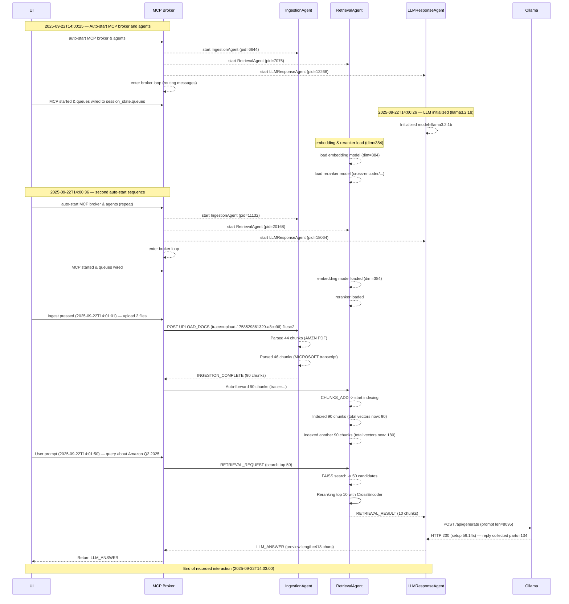

# MCP Agent Swimlane Diagram (horizontal timing)

Below is a Mermaid **sequence diagram** (swimlane-style) that shows the interactions and approximate timing between UI, MCP Broker, IngestionAgent, RetrievalAgent, and LLMResponseAgent / Ollama based on your logs. Paste this block into a Mermaid viewer (mermaid.live or VS Code Mermaid plugin) to render.

